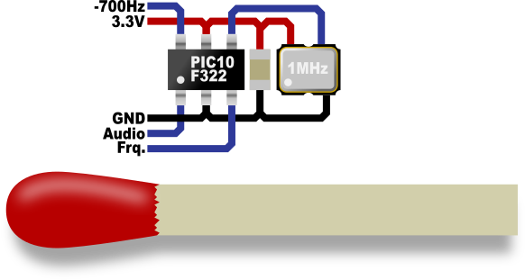

# 40m micro frequency counter

A micro frequency counter for 40m band.  
Counts a frequency from 7000.0 to 7200.0 kHz with 100Hz resolution.  
(Counter works from 6328.2kHz to 9999.9kHz but with less accuracy).  
Result is available as CW signal.  
Additional switch input for -700Hz shift.  

## Hardware
PIC10F322  
Connect a 1MHz reference oscillator to PIN RA2 (T0CKI)  
Connect the LO signal to RA1 (CLKIN)  
The audio signal is available on RA0  
Switch RA3 to GND to add an offset of -700Hz

The supply voltage 3.3V or 5V depends on the used oscillator.

It's also possible to choose THD components.
Then the size would be something like:

## IDE
IDE: MPLAB X ID v3.55  
MPLAB XC8 C Compiler (Free Mode) V1.30
 
2017-4-16
Gerd Bartelt
www.sebulli.com
